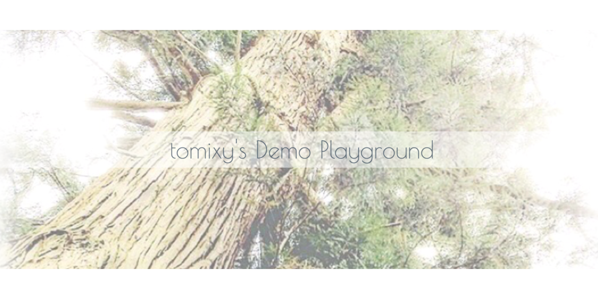
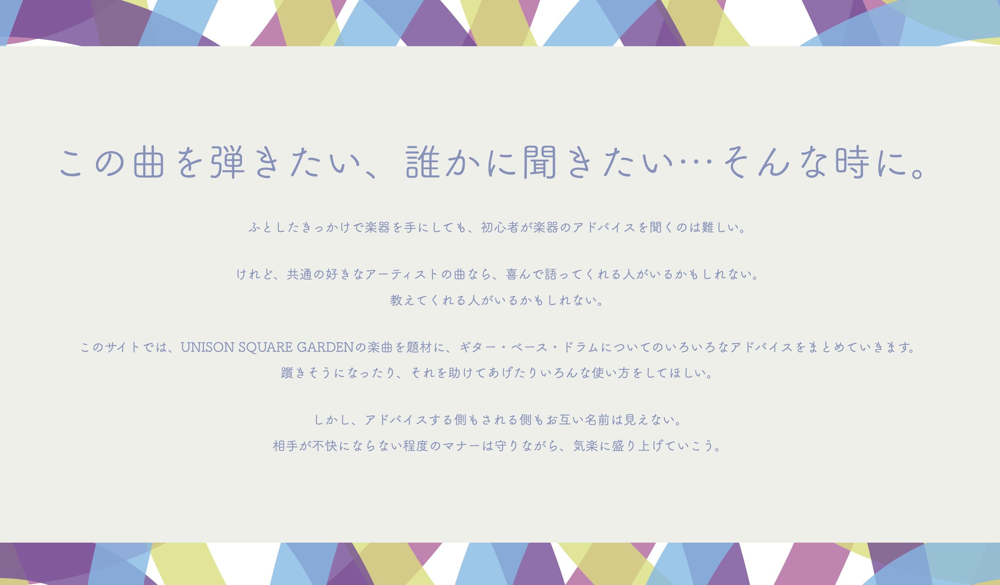
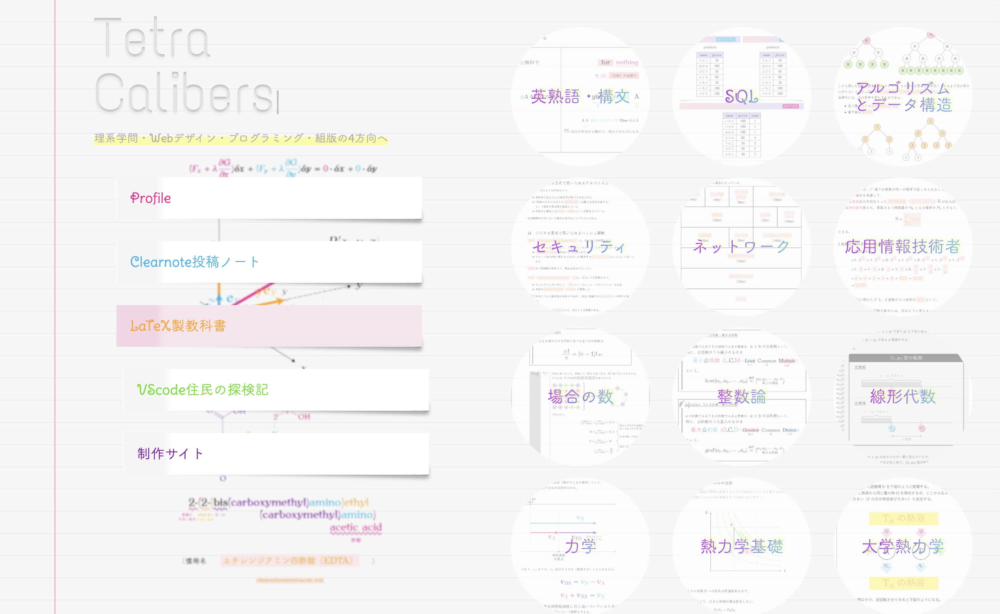

[USELESS-app-playground](https://useless-app-playground.herokuapp.com/)では、いろいろなデモプロジェクトを試運転しています。

『ガラクタ（USELESS）でもとりあえず誇る』が運営ポリシーです。

### 構成

- 【バックエンド】Laravel（API）
- 【フロントエンド】React（SPA）
- 【デプロイ・運用】heroku

# β版リリース

## Sing-History Maker

高校生活最後に慌てて作った自己分析管理アプリです。

今は歌唱練習記録に特化していますが、今後、スキルや経歴管理などの業務向けverや、ジャンル問わずさまざまな目標達成までの道のりを記録できる汎用性の高いアプリに発展させていきたいと考えています。

ソースコードは、本リポジトリの**ohako**ディレクトリに配置されています。

### 使用マニュアルと画面イメージは[こちら](resources/frontend/app/ohako/README.md)

### 構成

- 【バックエンド】Laravel
- 【フロントエンド】React

# 正式リリース

## Try Playing USG

プログラミング歴4ヶ月の頃に作ったバンドマン交流BBSサイトです。

[運用中の本番サイト](https://try-playing-usg.kuron.jp/)とは別に、[USELESS-app-playground](https://useless-app-playground.herokuapp.com/)ではリメイク版をぼちぼち作って公開しています。

リメイク版のソースコードは、本リポジトリの**tpusg**ディレクトリに配置されています。

また、共同執筆者募集の一環（と自らのポートフォリオ）として、管理画面のデモも近日公開予定です。

### デザイン解説書は[こちら](resources/frontend/app/tpusg/doc/trplUSGreport.pdf)

### 構成

- 本番運用中のサイト
    - WordPressオリジナルテーマとして制作
  - BBS機能は要件の都合上、既存のプラグインを使わずフルスクラッチPHPで自作
  - 【フロントエンド】jQuery
  - 【デプロイ】FTP
  - 【運用】レンタルサーバーで運用

- リメイク版デモ
  - 【バックエンド】Laravel
  - 【フロントエンド】React

## TetraCalibersCMS

プログラミング歴10ヶ月の頃に作った自分用CMSです。

プログラミングTipsブログや、理系学生向けのコンテンツを掲載しています。

管理画面のデモも近日公開予定です。
ソースコードは本リポジトリの**tetcali**ディレクトリに配置していきます。

### 構成

- 【バックエンド】Laravel
- 【フロントエンド】
  - サイト側：jQuery
  - 管理画面側：Vue
- 【デプロイ】VPS
- 【運用】VPS上に構築したkUSANAGI環境