# Sing-History Maker

## 新規登録・ログイン

[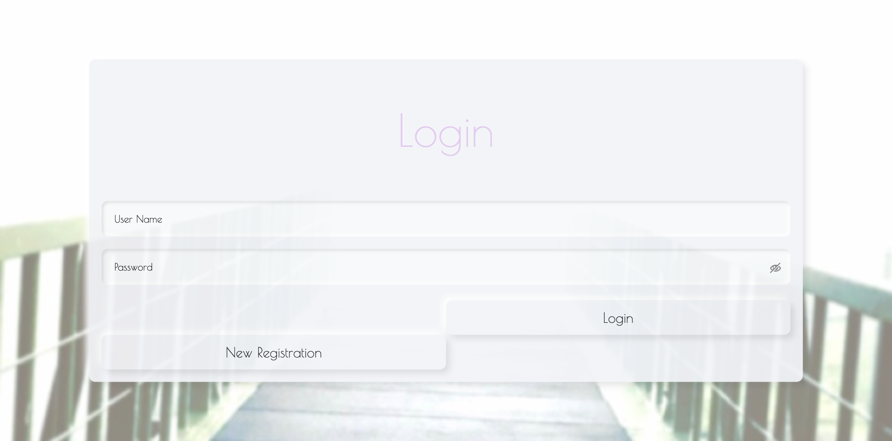](https://useless-app-playground.herokuapp.com/login)

## セットリスト（記録）一覧

## セットリスト（記録）の追加

右下の＋ボタンを押すと登録フォームが現れます。

- Sing Date
  - 歌った日
- Artist
  - アーティスト名
- Song Title
  - 曲名
- Key
  - 歌唱キー（シャープ、フラットの設定）
- Rate
  - 自己評価や難易度など
- Score
  - カラオケの採点結果
- Problem
  - 今後の練習課題
- Memo
  - メモ

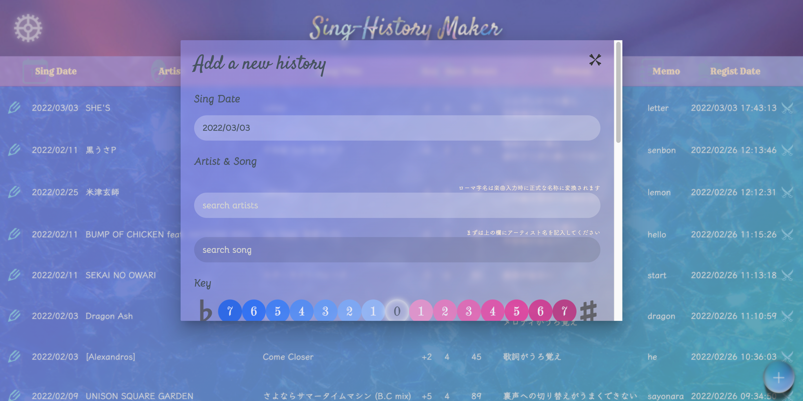

- 同じ日の記録を連続して追加しやすいよう、Sing Dateにはデフォルトで前回と同じ日時が入力されています

- アーティスト名はリアルタイム検索
  - まずは履歴から候補をサジェスト
  - 履歴の中に入力値に合致する候補がなければ、iTunes Search APIに問い合わせてサジェスト

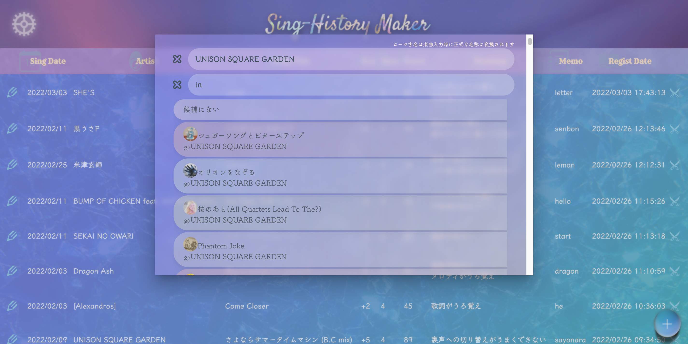

- 曲名もリアルタイム検索
  - 入力されたアーティストの楽曲をiTunes lookup APIから取得し、入力値に合致する候補をサジェスト

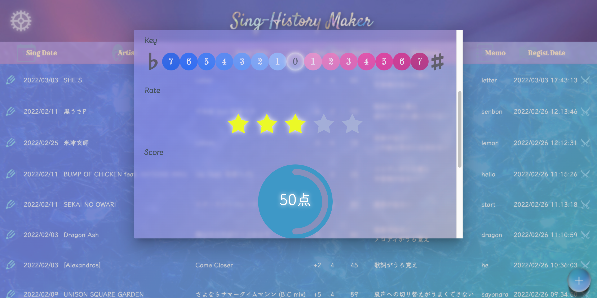

- 前にも歌ったことのある曲は、デフォルトで前回と同じ歌唱キーが入力されています
  - 「この曲、前はどのキーで歌ったっけ？」と悩む必要なし

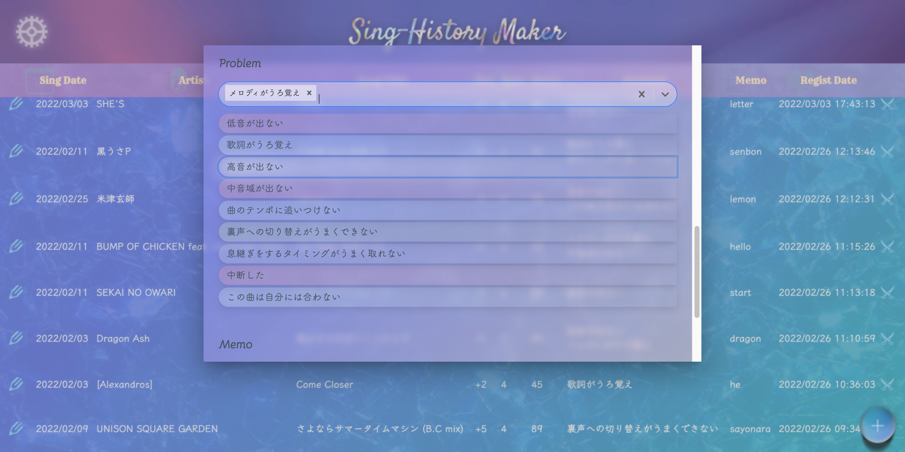

- 十八番や持ち歌として仕上げるために、今後の課題を明確化

## セットリスト（記録）の一覧表示設定

左上の歯車ボタンを押すと、表示設定サイドメニューが現れます。

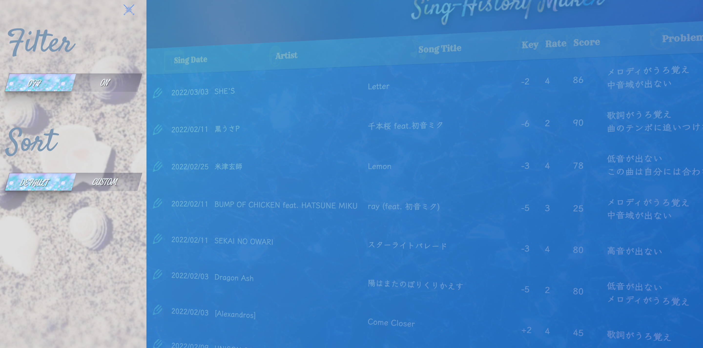

- Filterトグルボタン
  - OFF
    - 全セットリスト表示
  - ON
    - 絞り込みを有効化
  - ※一旦OFFにしても、絞り込み設定内容は保持されます
    - 再度ONにすれば前回と同じ絞り込みを再現可能
- Sortトグルボタン
  - DEFAULT
    - Sing Dateが新しい順（同じSing Dateのセットリストは、先に登録した順）
    - 「この日はどんな順序で歌ったのか」が一目でわかる順番です
  - CUSTOM
    - 好みの順序にソート可能に
    - ※一旦DEFAULTに戻しても、ソート設定内容は保持されます
      - 再度CUSTOMにすれば前回と同じ並び順を再現可能

### セットリスト（記録）の検索

- 選択式絞り込み
  - Sing Date
    - 歌った日で絞り込み
  - Artist
    - アーティストで絞り込み
  - Song
    - 曲名で絞り込み
  - Problem
    - 抱えている課題で絞り込み
- スライダー式絞り込み
  - Key
    - 歌唱キーの範囲で絞り込み
  - Rate
    - 自己評価や難易度で絞り込み
  - Score
    - カラオケの得点で絞り込み
- 検索
  - Memo
    - メモの内容で絞り込み

### セットリスト（記録）の並び替え

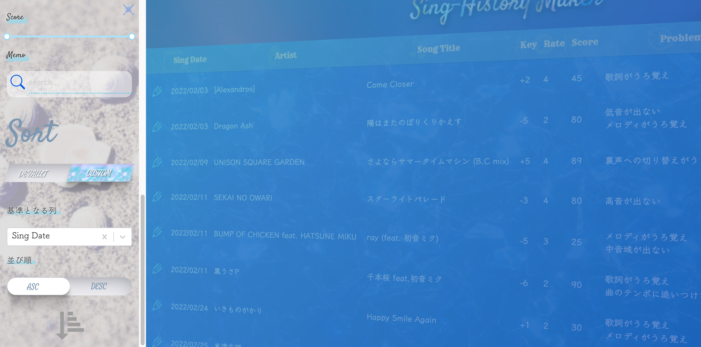

## セットリスト（記録）の編集

鉛筆ボタンを押すと、編集フォームが現れます

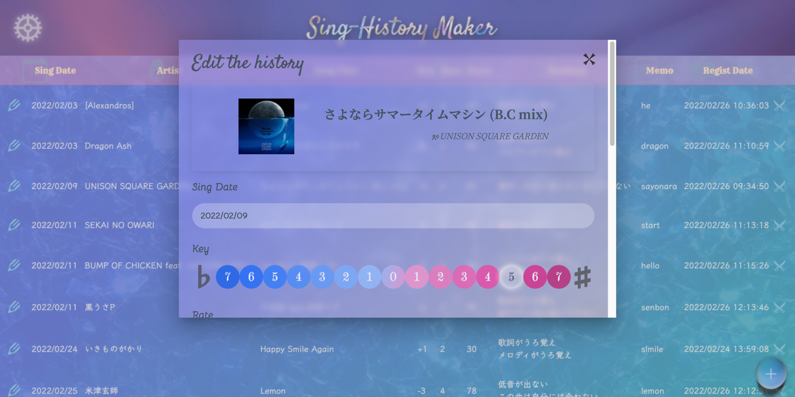

## セットリスト（記録）の削除

剣がクロスになった×ボタンを押すと、削除確認アラートが現れます

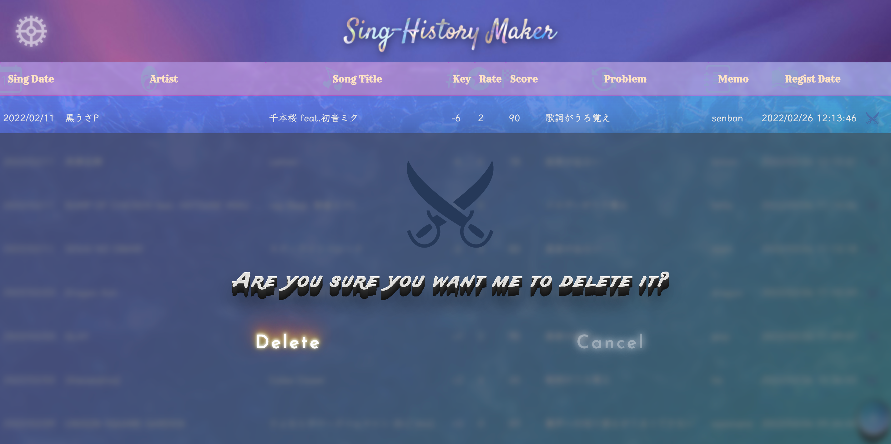

## スマートフォン版のイメージ
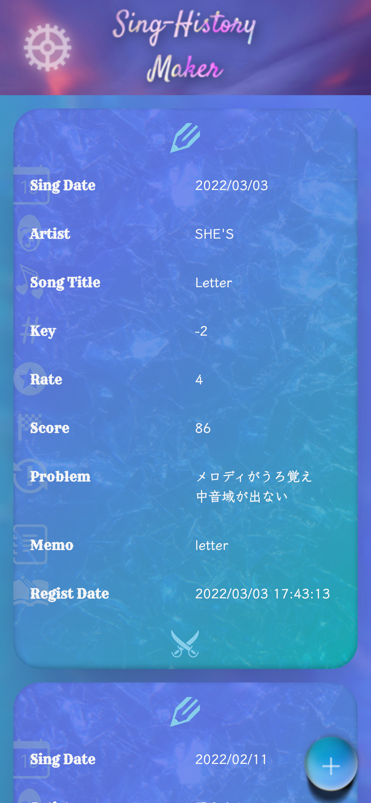

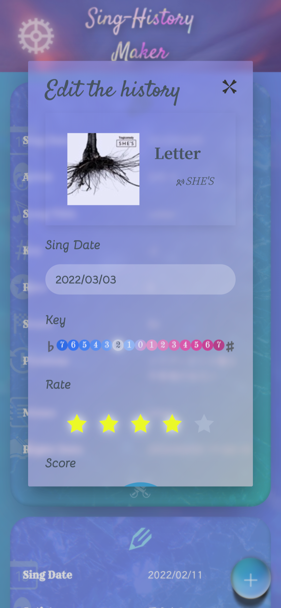